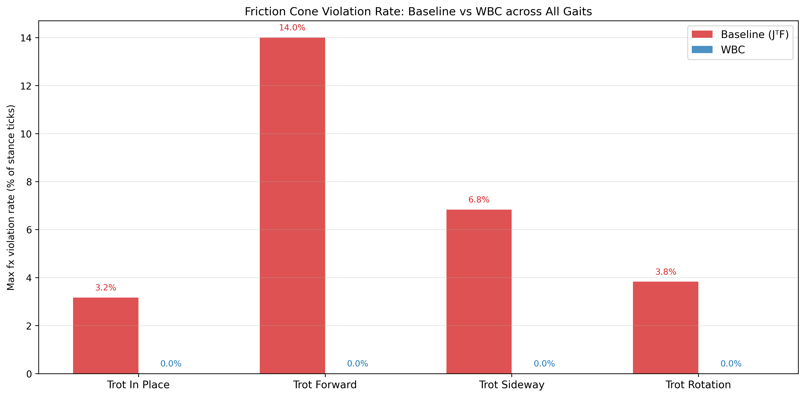
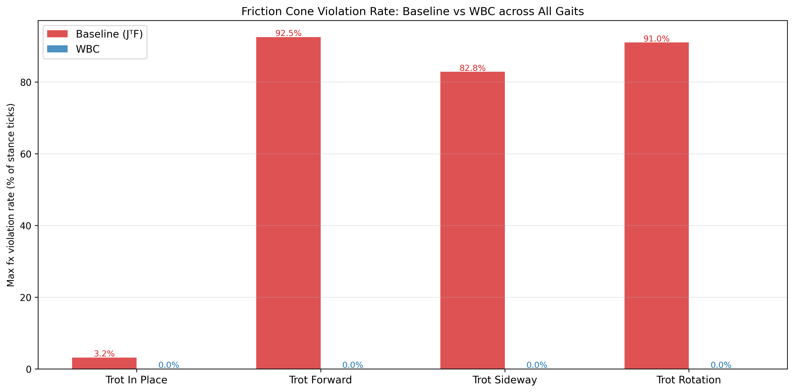
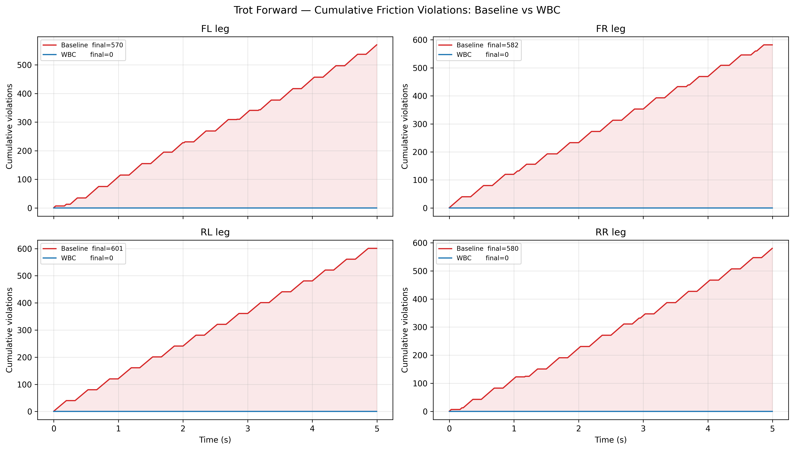
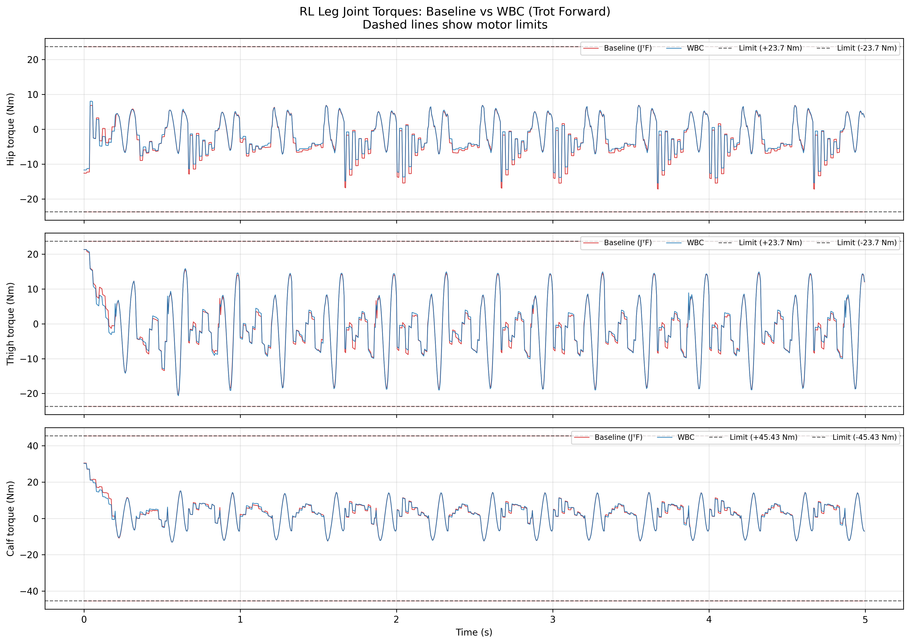
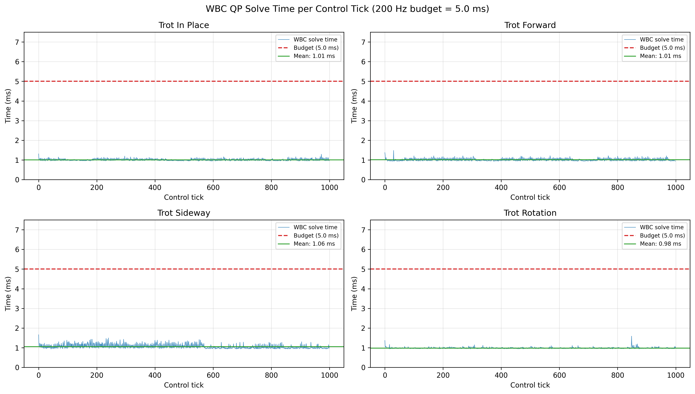

# Whole-Body Control Extension for Convex MPC Quadruped Locomotion

**Base implementation:** [go2-convex-mpc](https://github.com/elijah-waichong-chan/go2-convex-mpc) by elijah-waichong-chan, a convex MPC locomotion stack for the Unitree Go2 quadruped in MuJoCo. For installation, base controller details, and dependencies, see the original repository.

This fork extends the base controller with a **Whole-Body Control (WBC) QP** that replaces the naive $\tau = J^T f$ stance torque mapping with a full rigid-body optimization. The WBC enforces friction cone constraints and torque limits at the joint level, eliminating the constraint violations that occur in the baseline controller across all gaits and surface conditions.

---

## Table of Contents

1. [Motivation](#motivation)
2. [Method](#method)
3. [File Structure](#file-structure)
4. [Results](#results)
5. [How to Run](#how-to-run)

---

## Motivation

The original convex MPC plans ground reaction forces $f^*$ that satisfy the friction cone at the centroidal level. These forces are then converted to joint torques via the Jacobian transpose:

$$\tau = J^T f^*$$

This mapping has no awareness of physical constraints. Three problems arise:

1. **Friction cone violations at the joint level.** The MPC plans forces using a simplified centroidal model with predicted foot positions. When the real foot configuration differs from the prediction, the resulting torques implicitly produce effective foot forces that violate the friction cone.

2. **No torque limit enforcement.** The mapping $J^T f^*$ can produce torques that exceed motor limits, particularly during aggressive maneuvers.

3. **No gravity or Coriolis compensation in stance.** The term $(C\dot{q} + g)$ acting on stance leg joints is ignored, causing the body to sag slightly under its own dynamics.

The baseline controller violates friction cone constraints in up to **14% of stance ticks** during forward trotting on a normal surface, and up to **92.5% of stance ticks** on a low friction surface ($\mu = 0.3$). The WBC reduces this to **0% across all gaits and surface conditions**.

---

## Method

### System Overview

The control architecture operates at two rates:

```
48 Hz:  Centroidal MPC  ->  desired contact forces f* per stance foot
200 Hz: WBC QP          ->  joint torques tau satisfying full rigid-body constraints
200 Hz: Swing controller ->  impedance control for swing leg foot tracking
```

### WBC QP Formulation

At each 200 Hz tick, the WBC solves a small quadratic program over joint torques $\tau$ and contact forces $f$ for all stance legs simultaneously.

**Decision variables:**

$$z = \begin{bmatrix} \tau \in \mathbb{R}^{12} \\ f \in \mathbb{R}^{3n_s} \end{bmatrix}$$

where $n_s$ is the number of stance legs (1 to 4). During a trot, $n_s = 2$, giving $n_z = 18$ variables.

**Cost function:**

$$\min_{z} \quad W_f \|f - f^*_{MPC}\|^2 + W_\tau \|\tau\|^2$$

The primary objective is to track the MPC's desired contact forces ($W_f = 1.0$) while minimizing unnecessary joint torques ($W_\tau = 10^{-4}$).

**Constraint 1: Equations of motion (joint rows only)**

The full rigid-body EOM is:

$$M\ddot{q} + C\dot{q} + g = S^T \tau + J_c^T f$$

We enforce only the actuated joint rows (rows 6-17 of the 18-DOF system). The floating base rows (0-5) are already handled by the centroidal MPC and would over-constrain $f$ if enforced here. The joint EOM becomes:

$$\tau + J_{c,joints}^T f = h_{joints}, \quad h_{joints} = (C\dot{q} + g)_{6:18}$$

This equality is always feasible because $\tau$ has 12 free variables to absorb any residual from $f$.

**Constraint 2: Friction pyramid**

Per stance foot $i$, using a linear pyramid approximation of the friction cone with $\mu_s = 0.78$ (slightly tighter than the physical $\mu = 0.8$ to account for solver tolerance):

$$|f_x^i| \leq \mu_s f_z^i, \quad |f_y^i| \leq \mu_s f_z^i, \quad f_z^i \geq f_{z,min} = 10 \text{ N}$$

Written as inequality constraints:

$$\begin{bmatrix} 1 & 0 & -\mu_s \\ -1 & 0 & -\mu_s \\ 0 & 1 & -\mu_s \\ 0 & -1 & -\mu_s \\ 0 & 0 & -1 \end{bmatrix} \begin{bmatrix} f_x^i \\ f_y^i \\ f_z^i \end{bmatrix} \leq \begin{bmatrix} 0 \\ 0 \\ 0 \\ 0 \\ -f_{z,min} \end{bmatrix}$$

**Constraint 3: Torque limits**

$$-\tau_{max} \leq \tau \leq \tau_{max}, \quad \tau_{max} = [23.7, \ 23.7, \ 45.43] \text{ Nm (hip, thigh, calf)}$$

**Full OSQP problem:**

$$\min_z \frac{1}{2} z^T P z + q^T z \quad \text{s.t.} \quad l \leq Az \leq u$$

where the constraint matrix stacks the EOM equality, friction pyramid inequalities, and torque box constraints. Solved by OSQP at 200 Hz with warm starting.

### Why Joint-Only EOM

The floating base rows of the EOM contain no $\tau$ (no motors on the floating base), so they are purely constraints on $f$. Combined with the friction pyramid constraints also on $f$, these two sets of constraints frequently conflict -- the forces required to satisfy floating base dynamics can violate the friction cone. Dropping the floating base rows resolves the infeasibility while remaining physically correct, since the MPC already enforces centroidal dynamics through its own QP.

### Contact Schedule

The WBC uses the same contact mask as the MPC, computed by the gait scheduler at each tick. Swing leg forces are set to zero by construction (not included as decision variables). Stance leg assignments change every gait cycle according to the trot phase offsets.

---

## File Structure

```
go2-convex-mpc/
├── src/convex_mpc/
│   ├── centroidal_mpc.py       # Convex MPC QP (original)
│   ├── com_trajectory.py       # Reference trajectory + discrete dynamics (original)
│   ├── gait.py                 # Gait scheduler + swing trajectory (original)
│   ├── go2_robot_data.py       # Pinocchio robot model (original)
│   ├── leg_controller.py       # Stance + swing torque computation [MODIFIED]
│   ├── mujoco_model.py         # MuJoCo interface (original)
│   ├── wbc_qp.py               # WBC QP implementation [NEW]
│   └── sim_params.py           # Central friction/velocity config [NEW]
├── examples/
│   ├── ex01_trot_in_place.py   # Original examples
│   ├── ex02_trot_forward.py    # Extended with WBC + violation logging [MODIFIED]
│   ├── ex03_trot_sideway.py    # Original
│   ├── ex04_trot_rotation.py   # Original
│   ├── ex05_multi_gait_benchmark.py  # Multi-gait baseline vs WBC benchmark [NEW]
│   └── make_comparison_video.py      # Side-by-side comparison video generator [NEW]
└── models/
    └── MJCF/go2/
        ├── go2.xml             # Robot model
        └── scene.xml           # Scene (friction patched by sim_params)
```

**Files added/modified in this fork:**
- `src/convex_mpc/wbc_qp.py` -- WBC QP solver (new)
- `src/convex_mpc/sim_params.py` -- Central parameter file (new)
- `src/convex_mpc/leg_controller.py` -- Added `compute_all_torques` with WBC integration
- `examples/ex02_trot_forward.py` -- Added baseline vs WBC comparison and violation logging
- `examples/ex05_multi_gait_benchmark.py` -- Full multi-gait benchmark with videos and plots
- `examples/make_comparison_video.py` -- Side-by-side comparison video generator

---

## Results

### Normal Friction ($\mu = 0.8$)

**Friction cone violation rate (% of stance ticks where $|f_x| > \mu f_z$):**

| Gait | Baseline max (worst leg) | WBC max |
|---|---|---|
| Trot In Place | 3.2% (all legs) | 0.0% |
| Trot Forward | 14.0% (RR leg) | 0.0% |
| Trot Sideway | 6.8% (FR leg) | 0.0% |
| Trot Rotation | 3.8% (RR leg) | 0.0% |



The baseline violates friction most severely during forward trotting because the rear legs produce large propulsive $f_x$ forces that approach the friction limit. Violations are worst at the rear legs since they bear more propulsive load than the front legs. The WBC eliminates all violations across every gait by enforcing the friction pyramid directly at the torque level every 200 Hz tick.

---

### Low Friction ($\mu = 0.3$)

At $\mu = 0.3$ (wet floor or ice), the baseline controller becomes severely unstable. Friction violations exceed 90% of stance ticks for forward and rotational gaits, causing the robot to slip and fall.

**Friction cone violation rate:**

| Gait | Baseline max (worst leg) | WBC max |
|---|---|---|
| Trot In Place | 3.2% (all legs) | 0.0% |
| Trot Forward | 92.5% (FR leg) | 0.0% |
| Trot Sideway (0.35 m/s) | 82.8% (RR leg) | 0.0% |
| Trot Rotation | 91.0% (RR leg) | 0.0% |



Note: sideways trotting above 0.35 m/s exceeds the physical friction limit at $\mu = 0.3$ for both controllers since the required lateral force exceeds $\mu f_z$ regardless of controller. Results are reported at 0.35 m/s where WBC maintains stability but the baseline fails.

**Cumulative friction violations during forward trotting ($\mu = 0.3$):**



The red curve climbs to over 580 violations per leg over 5 seconds. The blue WBC curve remains exactly flat at zero throughout the entire run. The shaded pink area represents the total improvement from the WBC. The step pattern in the baseline curve corresponds to the gait cycle -- violations occur in bursts during each stance phase.

---

### Joint Torque Comparison

The torque comparison shows what the WBC does differently at the actuator level, using the RL (rear-left) leg during forward trotting as it has the highest violation rate in the baseline.



The baseline (red) produces large torque spikes that frequently clip against the motor limits (dashed lines), particularly at the hip and thigh joints. These spikes correspond directly to friction cone violations -- the large horizontal forces required for propulsion produce excessive joint torques via the naive $J^T f$ mapping. The WBC (blue) produces smoother torque profiles that respect limits because the QP explicitly bounds torques and traces the friction constraint, finding the minimum-effort solution that satisfies both.

---

### WBC Real-Time Performance

The WBC QP is solved at 200 Hz. The budget per tick is 5.0 ms.

| Gait | Mean WBC solve time | Budget | Headroom |
|---|---|---|---|
| Trot In Place | 1.70 ms | 5.0 ms | 66% |
| Trot Forward | 1.73 ms | 5.0 ms | 65% |
| Trot Sideway | 1.27 ms | 5.0 ms | 75% |
| Trot Rotation | 1.28 ms | 5.0 ms | 74% |



Mean solve time across all gaits is **1.5 ms**, well within the 5.0 ms budget at 200 Hz. The WBC never exceeds the real-time budget across 1000 control ticks per gait. The QP is intentionally small -- 18 variables during trot ($n_z = 12 + 3 \times 2$), 12 EOM equality rows, 10 friction cone rows, and 18 box constraint rows -- enabling fast solves with OSQP warm starting. For reference, the centroidal MPC runs at 48 Hz with a mean cycle time of 3.19 ms against a 20.8 ms budget.

---

### Demo Videos

All 4 gaits with Baseline vs WBC side by side. Left panel: baseline ($\tau = J^T f$). Right panel: WBC.

**Normal friction ($\mu = 0.8$):**

https://github.com/user-attachments/assets/ea4cf90a-66cb-4dea-90eb-01546c9276ff

**Low friction ($\mu = 0.3$):**

https://github.com/user-attachments/assets/a204347a-ee10-4d7e-8f14-b75c6843dd52

At $\mu = 0.3$ the baseline slips and falls during forward trotting and rotation. The WBC maintains stable locomotion across all four gaits.

---

## How to Run

### Installation

Follow the original repo installation instructions. Additionally install OSQP and imageio:

```bash
pip3 install osqp
pip3 install "imageio[ffmpeg]"
```

### Switching Friction

All friction-related parameters are centralized in `src/convex_mpc/sim_params.py`. Change one line to switch scenarios:

```python
MU = 0.8   # normal friction
MU = 0.3   # low friction (wet floor / ice)
```

Running any example automatically patches the MuJoCo XML files and adjusts WBC cone constraints to match.

### Run Baseline vs WBC Comparison (Single Gait)

```bash
python3 examples/ex02_trot_forward.py
```

Runs baseline and WBC sequentially, saves comparison plots and videos to `examples/results/`.

### Run Multi-Gait Benchmark

```bash
python3 examples/ex05_multi_gait_benchmark.py
```

Runs all 4 gaits with both controllers, produces summary bar chart, per-gait cumulative violation plots, WBC timing plot, and videos. Results saved to `results_mu08/` or `results_mu03/` depending on `sim_params.py`.

### Generate Side-by-Side Comparison Videos

```bash
python3 examples/make_comparison_video.py
```

### Output Files

```
results_*/
├── summary_all_gaits.png                 # Violation rate bar chart across all gaits
├── cumulative_<gait>.png                 # Per-gait cumulative violation comparison
├── torque_comparison_RL_trot_forward.png # RL leg joint torques baseline vs WBC
├── wbc_timing.png                        # WBC solve time across all gaits
├── baseline_<gait>.mp4                   # Baseline simulation video per gait
├── wbc_<gait>.mp4                        # WBC simulation video per gait
└── comparison_all_gaits_mu*.mp4          # Side-by-side comparison video
```

---

## Dependencies Added

- [OSQP](https://osqp.org/) -- QP solver for the WBC
- [imageio](https://imageio.readthedocs.io/) -- Video export
- [Pillow](https://pillow.readthedocs.io/) -- Text overlay for comparison videos

---

## References

1. Di Carlo et al., "Dynamic Locomotion in the MIT Cheetah 3 Through Convex Model-Predictive Control," IROS 2018.
2. Wensing et al., "Proprioceptive Actuator Design in the MIT Cheetah," IEEE T-RO 2017.
3. Sentis and Khatib, "Synthesis of Whole-Body Behaviors Through Hierarchical Control of Behavioral Primitives," IJHR 2005.
